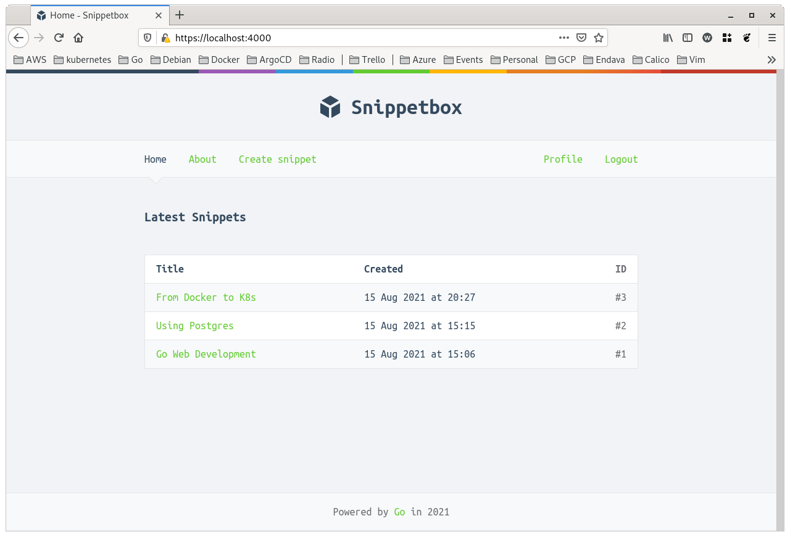

# Snippetbox Web Application

- Web Application with Go and PostgreSQL Database. 
- Based on the *[Alex Edwards book - Let's Go](https://lets-go.alexedwards.net/)*.
- The book is with MySQL and I migrated to PostgreSQL.

## Application



## PostgreSQL Database

- Database is created in Docker.
- Run `./scripts/init_db.sh` to create the database. (Docker must be running).

### Connect using an environment variable

```
psql $GREENLIGHT_DB_DSN
psql (13.9 (Debian 13.9-0+deb11u1))
SSL connection (protocol: TLSv1.3, cipher: TLS_AES_256_GCM_SHA384, bits: 256, compression: off)
Type "help" for help.

greenlight=>
```

### How to insert test information

```
INSERT INTO snippets (title, content, created, expires) VALUES (
    'An old silent pond',
    'An old silent pond...\nA frog jumps into the pond,\nsplash! Silence again.\n\n– Matsuo Bashō',
    CURRENT_TIMESTAMP,
    CURRENT_TIMESTAMP + interval '365 days'
);

INSERT INTO snippets (title, content, created, expires) VALUES (
    'Over the wintry forest',
    'Over the wintry\nforest, winds howl in rage\nwith no leaves to blow.\n\n– Natsume Soseki',
    CURRENT_TIMESTAMP,
    CURRENT_TIMESTAMP + interval '365 days'
);

INSERT INTO snippets (title, content, created, expires) VALUES (
    'First autumn morning',
    'First autumn morning\nthe mirror I stare into\nshows my father''s face.\n\n– Murakami Kijo',
    CURRENT_TIMESTAMP,
    CURRENT_TIMESTAMP + interval '365 days'
);
```

## Generating a self-signed TLS

```
mkdir tls && cd tls

go run /usr/local/go/src/crypto/tls/generate_cert.go --rsa-bits=2048 --host=localhost
```

## Run the application

```
go run github.com/thegodeveloper/snippetbox/cmd/web
```

## Build

```
go build -o /tmp/snippetbox github.com/thegodeveloper/snippetbox/cmd/web

/tmp/snippetbox
```
